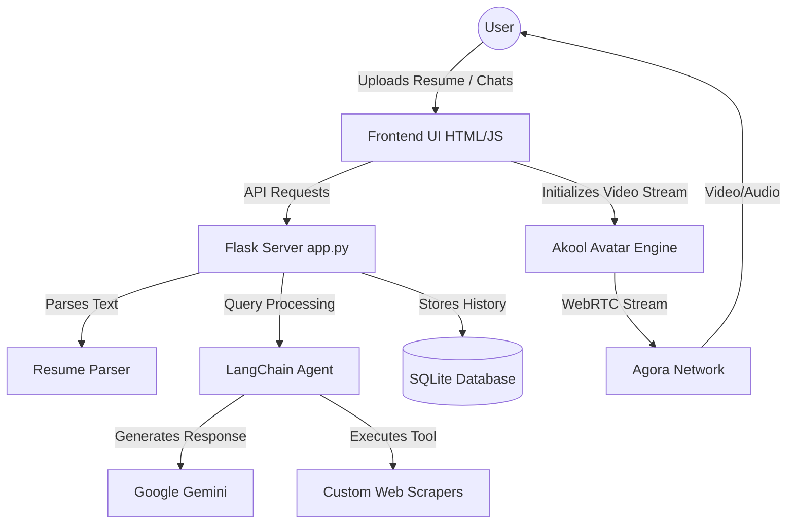

<div align="center">
  
# 🤖 AI Internship Finder Agent

**Your Ultimate AI-Powered Career Copilot**

[](https://python.org)
[](https://flask.palletsprojects.com/)
[](https://python.langchain.com/)
[](https://aistudio.google.com/)
*An intelligent, conversational AI platform designed to help students and job seekers find their perfect internships. **The entire platform operates exclusively through Cloud APIs** (utilizing Google Gemini for the core AI brain and Akool for the streaming avatar), meaning it runs blazing fast without requiring any heavy local GPU hardware.*

*Features include live resume parsing, real-time global internship search, persistent chat history, and a stunning interactive streaming avatar.*
[Explore Features](#✨-key-features) • [Installation Guide](#🚀-quick-start) • [Architecture](#🛠️-system-architecture)

</div>

---

## ✨ Key Features

| Feature | Description |
| :--- | :--- |
| 📄 **Smart Resume Parsing** | Upload a PDF resume to instantly extract your core skills, experience, and ideal roles using AI. |
| 💬 **Agentic AI Copilot** | Chat with a highly intelligent LangChain agent powered purely by the **Google Gemini API** for tailored career advice. |
| 🌍 **Live Job Aggregation** | Uses custom web scrapers to fetch real, active, and global internship postings in real-time. |
| 🗄️ **Persistent Chat History** | Automatically saves your conversations to a local SQLite database, allowing you to seamlessly switch between multiple chat threads. |
| 🎙️ **Live Streaming Avatar** | Integrated entirely via the **Akool Streaming Avatar API** and **Agora RTC** for a futuristic, visually speaking AI assistant without heavy local rendering. |
| 🎨 **Premium UI/UX** | Built with an ultra-modern dark-themed glassmorphism interface featuring butter-smooth animations. |
| 🎯 **AI Mock Interview Pro** | A rigorous virtual interview experience utilizing webcam proctoring right in your browser. |

---

## 🛠️ Tech Stack

<details>
<summary><b>Backend Technologies</b></summary>
<br>

- **Python & Flask**: Core web server and routing.
- **LangChain & LangGraph**: AI orchestration and agentic tool usage.
- **SQLite Database**: Lightweight, zero-config relational database for user data and chat history.
- **PyPDF2**: Intelligent document reading for resume uploads.

</details>

<details>
<summary><b>Frontend Technologies</b></summary>
<br>

- **HTML5 & CSS3**: Custom-built responsive UI with glassmorphism styling.
- **Vanilla JavaScript**: State management, real-time chat manipulation, and dynamic job card rendering.
- **Agora Web SDK**: Real-time communication for live video avatar streaming.

</details>

---

## 🚀 Quick Start

Follow these steps to run the AI Internship Finder locally on your machine.

### 1. Prerequisites
Ensure you have the following installed and ready:
- **Python 3.8+**
- Git
- Active API Keys for **Google Gemini** and **Akool** (if you want the avatar).

### 2. Clone & Install Dependencies
Open your terminal and run:

```bash
# Clone the repository
git clone https://github.com/artlinger2331/AI_INTERNSHIP_AGENT.git
cd AI_INTERNSHIP_AGENT

# Install all required Python packages
pip install -r requirements.txt
```

### 3. Environment Variables
Create a `.env` file in the root directory (where `app.py` is located) and add your keys securely:

```env
# 🧠 Required: For the AI to generate responses and parse resumes
GOOGLE_API_KEY=your-google-gemini-api-key-here

# 👤 Required: For the Live Avatar to initialize and speak
AKOOL_API_KEY=your-akool-api-key-here

# 👤 Optional: The ID of the specific Akool Avatar model
AKOOL_AVATAR_ID=default_avatar
```
> **Note**: Ensure your Google API Key is valid and active, or the chatbot will return an error.

### 4. Boot the Server
Start the production-ready server by running:

```bash
python app.py
```

### 5. Launch the Web App
Open your favorite web browser and navigate to:
```text
http://localhost:5000
```

---

## 🏗️ System Architecture

A high-level view of how the platform operates:



---

## 💡 Troubleshooting Guide

- **API Errors**: The chatbot will warn you if your Google API key is invalid or out of quota. Go to Google AI Studio to manage your keys.
- **Avatar Not Showing Up**: Ensure your `AKOOL_API_KEY` is correct. If the API key is missing or invalid, the app gracefully falls back to a standard text chatbot.
- **No Internships Found**: Ensure the target scraping platforms aren't blocking requests. Our system includes a safe fallback to a local mock database if scraping fails.

---

<div align="center">
  <p>Built with ❤️ for the next generation of professionals.</p>
</div>
